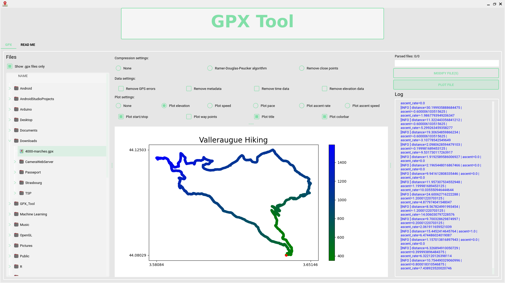

# 🌍 GPX Tool

## 🗺 Description
Easy to use GPX files utility software.

In its current state, this simple Python program can help you:
- Parsing GPX files following the TopoGraphix GPX 1.0 & 1.1 schemas.
- Modifying GPX files in order to remove GPS errors.
- Modifying GPX files in order to remove unused data (very handy when using a low power or low capacity GPS device).
- Plot GPX files content.
- Save modified GPX files.

## 📚 References
- [ezGPX](https://github.com/FABallemand/ezGPX)

## 👤 Author
- Fabien ALLEMAND

## 📧 Contact
- allemand.fabien@orange.fr